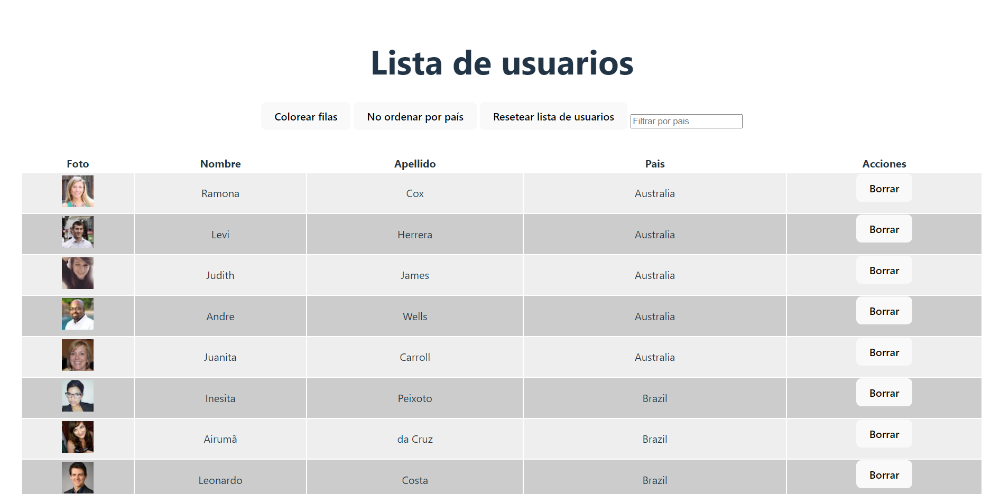

# DATA MANAGEMENT APP

Hello, this is my repo where I solve a mid level React technical test using ReactTS, and https://randomuser.me/ API.
Test solved previusly by Midudev on live coding stream https://www.twitch.tv/midudev/video/1792623213.

## TEST REQUEST

* [x] Fetch 100 rows of data using the API.
* [x] Display the data in a table format.
* [x] Provide the option to color rows. 
* [x] Allow the data to be sorted by country as demonstrated in the example.
* [x] Enable the ability to delete a row.
* [x] Implement a feature that allows the user to restore the initial state, meaning that all deleted rows will be recovered.
* [x] Handle any potential errors that may occur.
* [X] Implement a feature that allows the user to filter the data by country.
* [X] Avoid sorting users again the data when the user is changing filter by country.
* [x] Sort by clicking on the column header.
* [x] Provide a README.md file with instructions on how to run the application.
